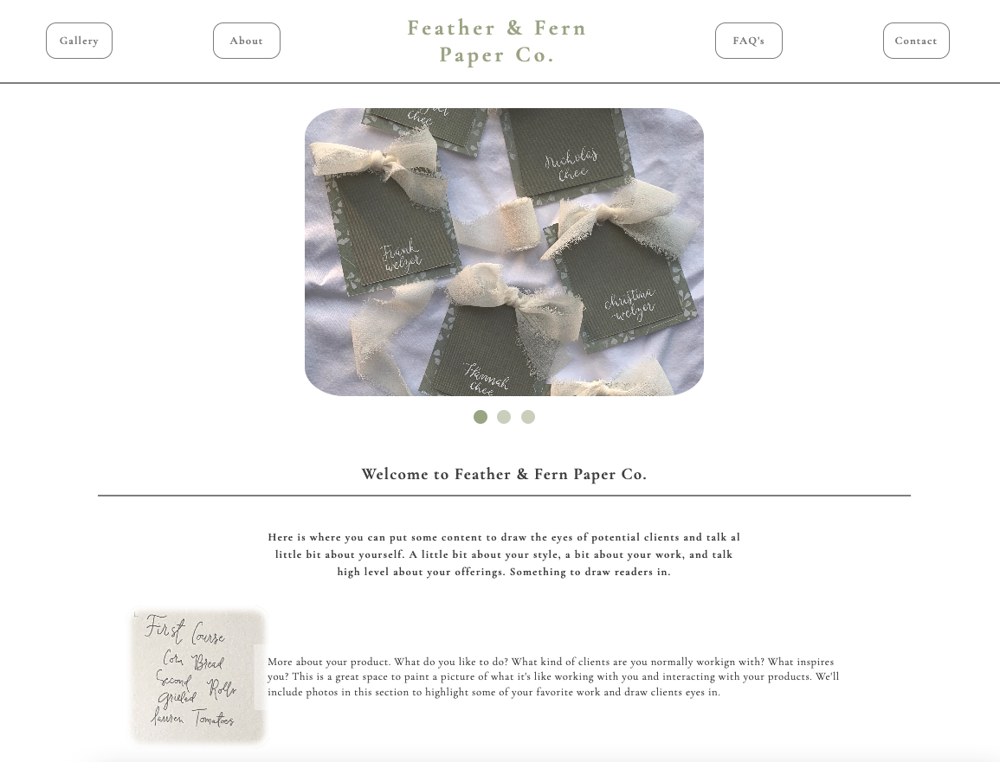
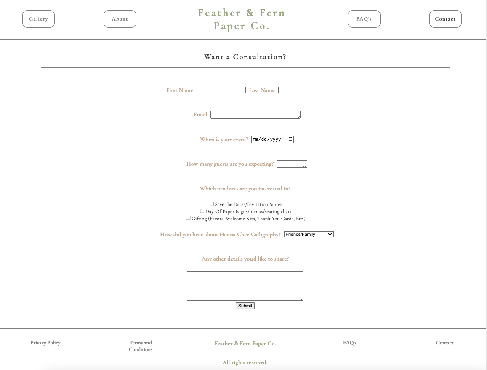
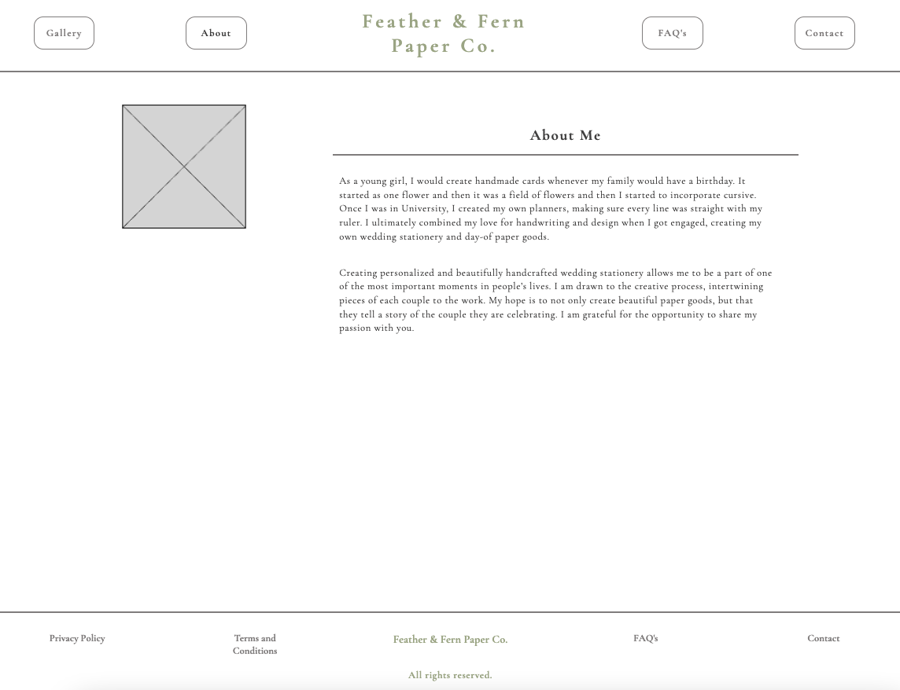
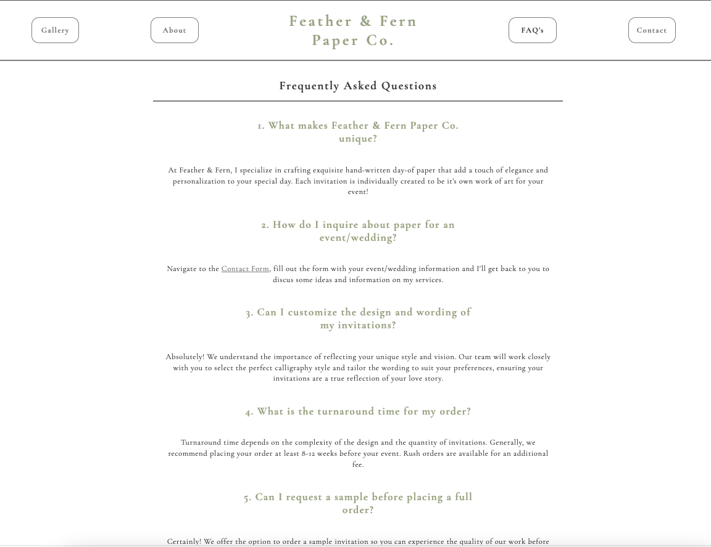
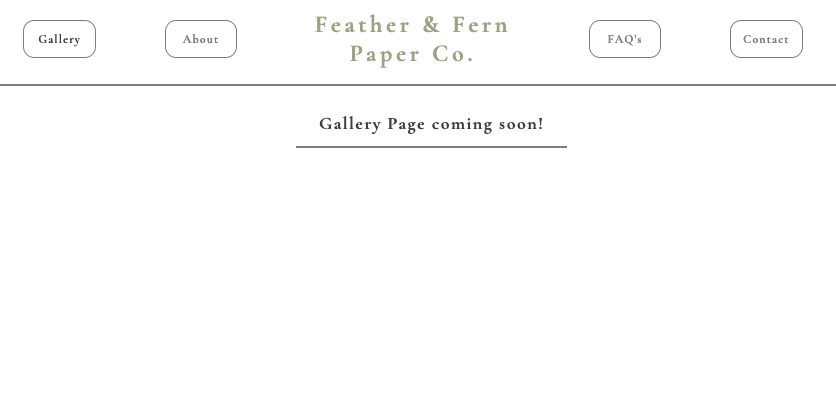

# Fern & Feather Paper Co.

<br>

Explore the custom calligraphy of Fern and Feather Paper Co. through this clean, elegant, and user-friendly website. Users can effortlessly reach out to the business, creating a smooth and efficient communication channel with the utilization of Mail.JS. The site also leverages an AWS S3 database backend to efficiently store gallery photos for rendering on the Gallery page to elevate the user experience.

<br>

[Click here to visit the page](https://fern-and-feather-paper-co-0e0b82f0b496.herokuapp.com/)

<br>

## Summary

This website is designed using a purely React + CSS front end along with a form created using the React-Bootstrap framework. The intention with this website was to provide a very smooth and interactive experience for endusers to promote the beauty of the products that Feather & Fern Paper Co. creates.

The gallery page utilizes an AWS S3 database to store gallery photos that are then easily retrieved to be displayed on the website via a lightweight Flask API. The page can adapt to screen sizes as large as a 27" monitor down to a mobile phone size seamlessly. The app is deployed using Heroku.

This project was meant to challenge my abilities in creating a functioning multi-page website with multiple features including a form that automaticlaly sends emails, a database integration, unique interactive style elements, and responsive design. I ran into some challenges with formatting for the form page that I solved with using flex elements and flex-grid and used media queries to adapt style according to screen size. The largest topic of learning for me has been learning baout hte AWS S3 product and integrating data from an S3 bucket into the gallery page. In the latest update, I was able to connect successfuly to the AWS S3 bucket that houses gallery photos and displayed the gallery link and photos using React components that fetch data using the Flask API.

Next steps in this project include creating a private portal to enable the business owner to upload new galleries to the database for display.
<br>

Author

- **Natalie Salazar** - Software Developer [Portfolio](https://www.natalie-salazar.io/) [LinkedIn](https://www.linkedin.com/in/natalie-m-salazar/)

<br>

### Hero Page



### Contact Form Page



### About Page



### FAQ Page



### Gallery Page



<br>

## Setup Instructions

### Frontend Setup

1. Clone this repository:

   ```
   gh repo clone natsal33/feather-and-fern-paper-co
   ```

2. Install dependencies:

   ```
   npm install
   ```

3. Start the development server:

   ```
   npm start
   ```

### Backend Setup

1. Navigate to the `app` directory:

   ```
   cd app
   ```

2. Create a virtual environment:

   ```
   python3 -m venv venv
   ```

3. Activate the virtual environment:

   - On macOS and Linux:

     ```
     source venv/bin/activate
     ```

   - On Windows:

     ```
     venv\Scripts\activate
     ```

4. Install dependencies:

   ```
   pip install -r requirements.txt
   ```

5. Configure the Flask application:

   - update FLASK_APP by using:
     '''
     EXPORT FLASK_APP=routes.py
     '''

6. Run the Flask application:

   ```
   flask run
   ```

# NOTE: You will need to configure Flask API to pull from an AWS S3 database that you have access to, so changing the bucket URL and hte photo URLs will be required.

## Tech Stack

- Frontend:

  - React
  - JavaScript
  - HTML/CSS

- Backend:

  - Flask (Python)

- Database:
  - AWS S3

## License

This project is licensed under the MIT License. See the [LICENSE](LICENSE) file for details.

## Contact

If you have any questions or suggestions, feel free to contact me at natmsal33@gmail.com. We'd love to hear from you!
